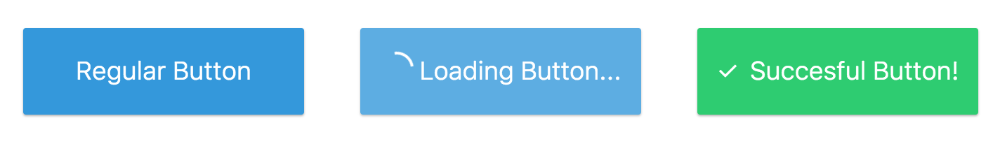
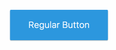

# JSX Conditional / Events Challenge

You will need to alter `js/App.js` and `js/components/Button.js` to complete the
following challenges. Only attempt a challenge after the lesson has concluded,
don't jump ahead! You might be lost otherwise.

## 1) JSX Conditionals Challenge

* Change the `Button` class' render to do the following
	* If the `isLoading` prop is true, the button has an `is-loading` class, AND
	it renders a `` element behind the text, AND
	the text is replaced with the words "Loading..."
	* If the `isSuccessful` prop is true, the button has an `is-successful` class,
	AND it renders a `` element behind the children

Your final output should look like:

## 2) JSX Events Challenge

* Remove the hard-coded `isLoading` and `isSuccesful` buttons so you only have 1
* Change the `Button` class to take in an `onClick` prop that is called if the
button isn't loading or disabled
* Have `App.js` pass an `onClick` prop function to the button that:
	1. Marks the button as loading
	2. Two seconds later, marks the button as isSuccessful, and not isLoading
* In order to do this, you will want to set some state on the `App` component,
and pass that state as props to the first button.

Your final output should look like:

